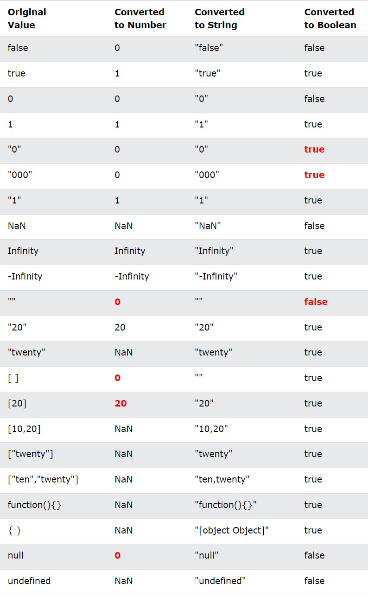

# Type Casting

### Today's agenda
1. Type casting
    - Implicit type casting
    - Explicit type casting
2. Type co-ercion
3. Type conversion vs Co-ercion

## Type casting
- Type casting or type casting means transfer of data from one data-type to another.
    - **Implicit typecasting** : Implicit conversion or typecasting happens when the runtime-enviornment of Javascript automatically converts data types.
    - **Explicit typecasting** : Explicit conversionor typecasting is done when we explcitly requires a conversion to happen.

Example:
```javascript
const a = "foo";
const b = 1;
console.log(a+b); // prints "foo1" . Implicit typecasting

console.log(Number("0x11")); // prints 17, for explicitly done 
```
- String conversion : `String(value)`
- Numeric conversion : `Number(value)`
- Boolean conversion : `Boolean(value)`

## Type coercion
Type coercion is the automatic or implicit conversion of values from one data-type to another. (such as string to number)

## Difference between Type coercion vs Type conversion
Type coercion is implicit whereas type conversion can be either implicit or explicit.

## Javascript type conversion table
