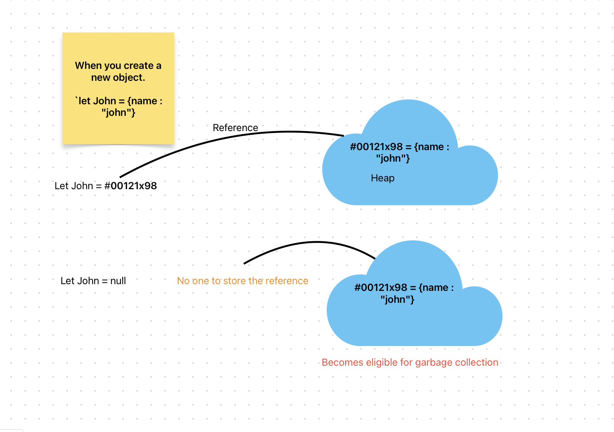

# Data structures

### Today's agenda
- Shallow copy vs deep copy
- Indexed Collections
    - Typed Arrays
    - Arrays
        - Stack
        - Queue
- Structured Data
    - JSON
- Keyed Collection
    - Map
    - Weak Map
    - Set
    - Weak Set

## Shallow copy vs deep copy
- A **shallow copy** of an object is a copy, whose properties have the same reference as the source object from which copy was made.
- Their prototype chains are equal.
- The values of their properties are equal.

**Properties**
- Only top level properties are copied and not the values of the nested objects
- Re-assigning top-level properties of the copy does not affect the source object.
- Re-assiginig the nested object properties of the copy does affect the source object.

**Methods used to create a shallow copy**
- `spread operator syntax`
- `Array.prototype.concat()`
- `Array.prototype.slice()`
- `Array.from()`
- `Object.assign()`

See the example in .js file.

## Indexed Collection
- Indexed collection are collections that have numeric indices. i.e the collection of data that are ordered by an index value.
- Array
- Typed Array

### Typed Array
- Used for manipulating binary data
- Examples: `Int8Array`, `Uint8Array`, etc.

### Array
- Arrays is the object that allows you to store keyed collections of values.
- Array can store any type of data inside it.

**Declaration**
```javascript
// using new Array()
let arr = new Array();
// using array literal
let arr = [];
```

#### Use cases of Arrays
- Queue
- Stack

**Queue**
- A queue is one of the most common uses of an array.
- This means an ordered collection of elements which supports two operations:
    - `push` - appends an element to the end.
    - `shift` - get an element from the beginning, advancing the queue.(2nd element becomes the 1st element and so on).

**Stack**
- A stack is another use case of an array.
- It supports 2 operations:
    - `push` - appends an element to the end.
    - `pop` - takes an element from the end.


**Performance**
- Method `push/pop` runs faste, than `shift/unshift`.

## Structured Data
- We use structured data to display data in the web pages, it has a defined structure that we follow.
- We use JSON (JavaScript Object Notation)

**JSON**
- JSON is a text-based format for representing structured data based on Javascript object syntax.
- It has 2 methods:
- **JSON.parse()** : Parsed a JSON string to object.
- **JSON.stringify()** : Return a JSON string from the object.


## Keyed Collections
- Javascript keyed collection are structured collection of data that stores values and provide methods for easily accessing them.
- Keyed collections were actually introduced with ES6 as an alternative to arrays and objects to cope up with array and obejcts limitations.

For example:
- To iterate over an object or to sort i, You had to first convert it to an array, the perform those operations.
- In arrays, if you need to pull out a specific value without its index, it was not straight-forwards.


### Set
- `Set` is a collections of unique values.
- Before ES6, Javascript didn't have a data structure for sets. Instead, two workarounds were used:
    - The keys of object were used as a set of string.
    - Arrays were used as a set of values. The downside was checking if an array contains a value is slower.

**Methods**
- add
- has
- delete
- clear
- size

**Iterating over set**
- use `for of` loop to iterate over set.

Example
```javascript
// there are 2 ways to create a new Set

// Way - 1 using Set() constructor empty
const emptySet = new Set();
assert.equal(emptySet.size, 0);

// Way -2 from using the iteratables
const set = new Set(['red','blue', 'green']);

// Methods
// Adding elements to the set
set.add("yellow");

// Has - to check the element is member of the set
const isYellowPresent = set.has("yellow"); // returns true or false.

// size to check the size of the set
const sizeOfSet = set.size;
console.log(sizeOfSet);

// delete - delete an element from the set
const isDeleted = set.delete("red");
console.log(set);

for(const color of Set){
    console.log(color);
}


// clear - remove all the elements from the set
set.clear();
```

## Garbage Colelction mechanism

Before we start with Weak set, lets understand the garbage collection first.

Let's understand the diagram.
- The cloud refers to the heap memory where all the objects are created and stored.
- Every object created has a reference attached to it.
- When we assign a variable an object, the reference is stored inside a variable which is used to reach the object.
- When we re-assign that variable to hold something else, let say `null`.
- In this case, object becomes unusable and the **Garbage collection** destroys it.

Example:
```javascript
let john = { name : "John" };
// the object can be accessed, john variable store the reference to it.
// let's overwrite the reference with something else

john = null;
// Now the object created becomes eligible for the garbage collection.
```
Now with sets
```javascript
let person = { name:"john", age: 18, year:1998 };
const set = new Set();
set.add(person);

person = null; // the object reference is over-ridden but the object stays in the set
for(let x of set){
    console.log(x); // the object
}
```
- To overcome this issue, weakset is used.

### Weak Set
- Weak set only add object and not primitives.
- An object exisits in the set, only when it's reachable from somewhere else and not the weakset.
- It only has `add()`, `has()` and `delete()` methods.
- It does not have `size()`, `keys()` and not iterations.

Example:
```javascript
let john = {name:"john"};
let mary = {name:"mary"};
let pete = {name:"pete"};

const weakSet = new WeakSet();
weakSet.add(john);
weakSet.add(mary);
weakSet.add(pete);

john = null;
// the weakSet will be cleared automatically
```

**Use Case** : Detecting circular reference


```javascript
// Execute a callback on everything stored inside an object
function execRecursively(fn, subject, _refs = new WeakSet()) {
  // Avoid infinite recursion
  if (_refs.has(subject)) {
    return;
  }

  fn(subject);
  if (typeof subject === "object" && subject) {
    _refs.add(subject);
    for (const key in subject) {
      execRecursively(fn, subject[key], _refs);
    }
    _refs.delete(subject);
  }
}

const foo = {
  foo: "Foo",
  bar: {
    bar: "Bar",
  },
};

foo.bar.baz = foo; // Circular reference!
execRecursively((obj) => console.log(obj), foo);

```


### Map
- Map is a collection of keyed data items just like an Object.
- The main difference is that Map allows keys of any data type, but Object only allows string.

**Methods and properties are:**
- `new Map()` : creates a new Map.
- `map.set(key, value)` : store the values of the key
- `map.get(key)` : returns the value by the key, returns `undefined` if key does not exist in Map().
- `map.has(key)` : returns true if exists, else false
- `map.delete(key)` : removes the key/value pair.
- `map.clear()` : removes everything from the Map.
- `map.size` : returns the current element count.

**Iterating over Map**
- To iterate over a Map, there are 3 methods:
  - `map.keys()` : returns iteratable for keys of Map
  - `map.values()` : returns iterable for values of Map
  - `map.entries()` : returns an iterable for enteries [key, value] it is used by default in for..of


Example:
```javascript
const map = new Map();
const john = { name : "shubham" }
map.set("abc", 12);
map.set(john, true);

console.log(map.get(john));
console.log(map.has("abc"));
console.log(map.delete("abc"));
console.log(map);
console.log(map.size);

john = JSON.stringify({ name : "Shubham" , age:15 });
map.set(john, "{take:true}")
map.set("1", 1);
map.set(true, 123);
for(let [key, value] of map){
  console.log(`Values: ${key}, ${value}`)
}
```

### WeakMap
- WeakMap is similar to Map, but the keys must only be objects.
- the Key,value pair only exist till the object is reachable somewhere else in the code as well.
- It does not allows primitive data type.
- WeakMap does not support iteration and it's methods:
- Weak map only has following methods

**Methods**
- `new WeakMap()` = creates a new weak map.
- `weakmap.set(key, value)` : add the key, value pair to the weak set
- `weakmap.get(key)` : return the value of the key if it exists, else undefined
- `weakmap.has(key)` : returns the true/false if the value is present or not
- `weakmap.delete(key)` : deletes the key from the map