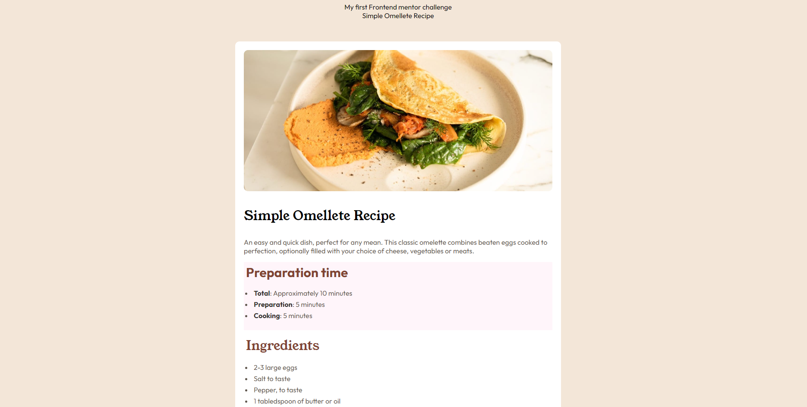
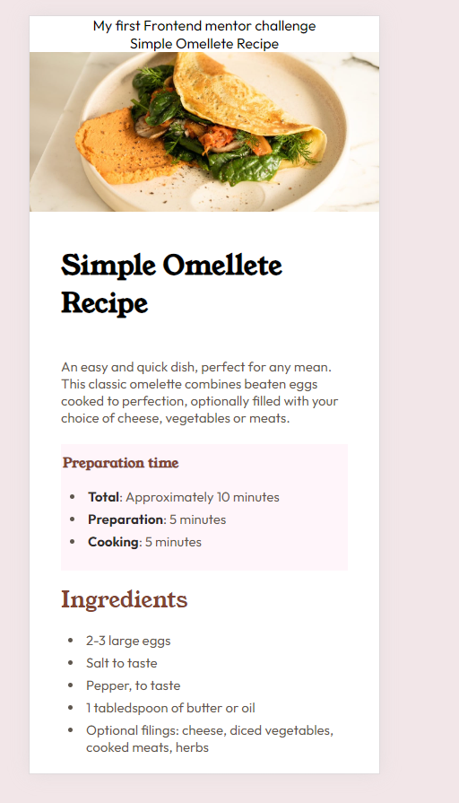

# Frontend Mentor - Recipe page solution

This is a solution to the [Recipe page challenge on Frontend Mentor](https://www.frontendmentor.io/challenges/recipe-page-KiTsR8QQKm). Frontend Mentor challenges help you improve your coding skills by building realistic projects.

## Table of contents

- [Overview](#overview)
  - [The challenge](#the-challenge)
  - [Screenshot](#screenshot)
- [My process](#my-process)
  - [Built with](#built-with)
  - [What I learned](#what-i-learned)
  - [Continued development](#continued-development)
  - [Useful resources](#useful-resources)
- [Author](#author)
- [Acknowledgments](#acknowledgments)

## Overview

The root of the project contains `final` and `starter` files. The final directory contains the solution by me.

```
 | - final : Solution
 | - starter : assets
```

### Screenshot



This is a desktop view of the solution which is > 600px for larger screen.



This is view for smaller screen mobile < 600px.

## My process

### Built with

- Semantic HTML5 markup : header, nav, section
- Non-semantic HTML5 markup : div, span, table, li ul, ol, td tr
- CSS custom properties - font-face, CSS variables
- Flexbox : none
- CSS Grid : none
- Mobile-first workflow : used media screen

### What I learned

I have restarted to revise my frontend skills, I learned following things

Learned some of the semantic elements like: header, nav section

```html
<header>
  <nav></nav>
</header>
```

Accessing the first child and nth-child(n) simple

```css
table tr td:first-child {
  font-family: "outfit";
  padding: 8px;
}
table tr td:nth-child(2) {
  color: var(--nutmeg);
  font-weight: 700;
  font-family: "outfit";
  padding: 8px;
}
```

Using media queries

```css
/* Bigger devices */
@media only screen and (min-width: 600px) {
}
```
